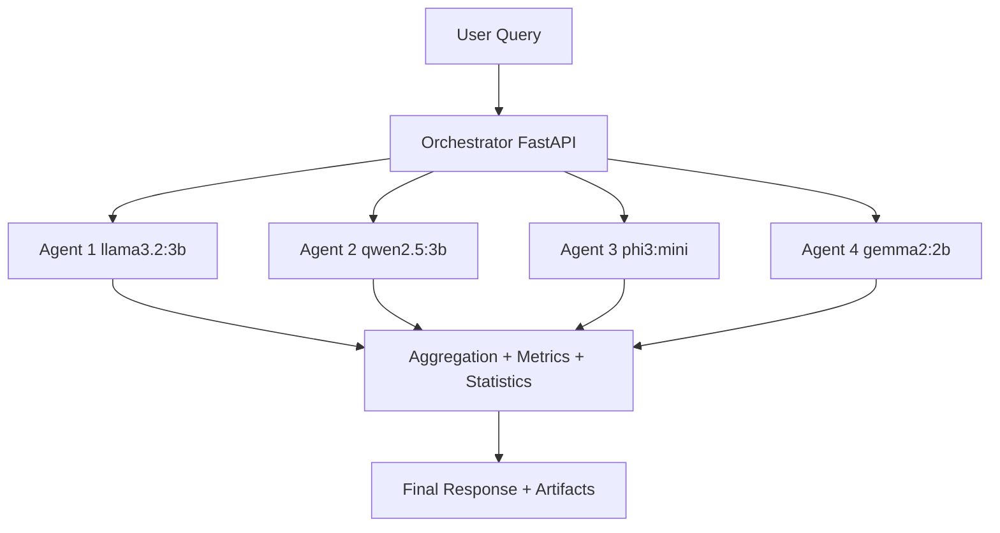

# Distributed AI Ensemble (Local Multi-Agent LLM Network)

<div align="center">

[](#quick-start)
[](#system-architecture)
[](#agent-models)
[](#evaluation-and-statistics)
[](#paper-package-ieee--overleaf)

*A fully local distributed AI research system with orchestration, ensemble inference, reproducible benchmarking, statistical testing, visual analytics, and publication-ready artifacts.*

</div>

---

## Overview

This repository implements a complete local distributed AI network for research.

The workflow is simple:

1. A user query goes to one orchestrator node.
2. The orchestrator sends that query to multiple local model agents.
3. Each agent runs a different LLM and returns answer + latency + token metadata.
4. The orchestrator aggregates the responses using switchable ensemble strategies.
5. All metrics are logged and exported into publication-ready outputs.

This project is designed for reproducibility and IEEE-style reporting.

---

## Authors

- **Md Anisur Rahman Chowdhury<sup>1*</sup>**, **Kefei Wang<sup>1</sup>**
- **<sup>1</sup>** Dept. of Computer and Information Science, Gannon University, USA
- Emails: `engr.aanis@gmail.com`, `wang039@gannon.edu`

---

## What We Built and Why

### 1) Distributed inference cluster

- **Why**: test multi-model collaboration instead of single-model output.
- **Built**: one orchestrator VM + four model-agent VMs on a private LAN.

### 2) Modular ensemble strategies

- **Why**: compare aggregation algorithms under the same benchmark pipeline.
- **Built**: Majority, Weighted, ISP, Topic Routing, Debate.

### 3) Reproducible benchmark framework

- **Why**: produce repeatable, statistically valid evaluation.
- **Built**: MMLU, GSM8K, TruthfulQA runners with deterministic controls.

### 4) Publication artifact generation

- **Why**: directly support conference submission workflow.
- **Built**: CSV/JSON exports, PNG plots, IEEE LaTeX tables, IEEE paper source, Overleaf package, and PDF.

### 5) GitHub-hosted visual interface

- **Why**: make results easy to explore and present.
- **Built**: `docs/` web site + interactive dashboard with charts.

---

## System Architecture

### VM mapping

- **Orchestrator**: `172.16.185.223`
- **Agent 1**: `172.16.185.209` (`llama3.2:3b`)
- **Agent 2**: `172.16.185.218` (`qwen2.5:3b`)
- **Agent 3**: `172.16.185.220` (`phi3:mini`)
- **Agent 4**: `172.16.185.222` (`gemma2:2b`)

### Logical flow (ASCII)

```text
User Query
   |
   v
Orchestrator (FastAPI)
   |---> Agent-1 (Ollama)
   |---> Agent-2 (Ollama)
   |---> Agent-3 (Ollama)
   |---> Agent-4 (Ollama)
   v
Aggregation + Metrics + Statistical Testing + Artifact Export
```

### Interactive Architecture (Mermaid)



Interactive public version:
- `https://anis151993.github.io/Distributed-AI/#architecture`

### Orchestrator endpoints

- `GET /health`
- `GET /agents`
- `POST /query`

---

## Agent Models

Each agent exposes Ollama REST API on port `11434` and returns:

- `response`
- `latency_ms`
- `token_count`
- `model_id`

Configured model set in this run:

- `llama3.2:3b`
- `qwen2.5:3b`
- `phi3:mini`
- `gemma2:2b`

You can swap to other models (CPU/GPU permitting) through `agents/agent_config.yaml`.

---

## Aggregation Strategies

Implemented and switchable at runtime:

- `majority`
- `weighted`
- `isp`
- `topic`
- `debate`

All strategies are modular in orchestrator code:

- `orchestrator/aggregator.py`
- `orchestrator/router.py`
- `orchestrator/debate.py`

---

## Runtime Optimizations Added

To reduce bottlenecks in CPU-friendly settings:

- Shared direct-strategy fan-out (single agent call reused by majority/weighted/ISP/topic)
- Debate early-stop when round-1 agreement is complete
- Conservative token budgets and timeout tuning for local hardware
- Better answer normalization for benchmark parsing stability

---

## Evaluation and Statistics

### Benchmarks

- MMLU
- GSM8K
- TruthfulQA

### Metrics

- Accuracy
- F1
- Mean latency
- Latency std
- Agreement rate
- CPU / GPU usage

### Statistical tests

- Paired t-test
- Wilcoxon signed-rank
- Confidence intervals

---

## Generated Outputs

Outputs are generated as:

- CSV
- JSON
- PNG plots
- IEEE LaTeX tables

Primary artifact folders:

- `artifacts/benchmark_runs/run_20260226_193331/`
- `artifacts/optimization_runs/`

Key files:

- `overall_summary.csv`
- `overall_summary.json`
- `overall_significance.csv`
- `paper/tables/aggregate_strategy_results.tex`
- `paper/tables/per_benchmark_results.tex`
- `paper/tables/significance_highlights.tex`

---

## Visual Results

<div align="center">


</div>

---

## Web Display (GitHub Pages)

Web UI files:

- `docs/index.html` (public research portal)
- `docs/interactive_dashboard.html` (interactive charts)
- `docs/styles.css`
- `docs/script.js`
- `docs/assets/data/report_data.js` (embedded chart data)
- `docs/assets/paper/IEEE_Distributed_AI_Ensemble.pdf` (public embedded paper)
- `docs/assets/results/*.csv|*.json` (public downloadable benchmark outputs)

Public portal features:
- Interactive architecture map (click nodes + flow simulation)
- Live AI playground (`/query` API caller with strategy controls)
- Embedded IEEE paper reader
- Direct links to project repository and GitHub profile

Enable on GitHub:

1. Open repository **Settings**.
2. Go to **Pages**.
3. Source: `main` branch, folder `/docs`.
4. Save.

Local preview:

```bash
cd docs
python3 -m http.server 8080
# open http://localhost:8080
```

Public URL:
- `https://anis151993.github.io/Distributed-AI/`

### Public playground connection (required once)

If you want browser visitors to run live queries from GitHub Pages, set CORS on the orchestrator:

```bash
export CORS_ALLOW_ORIGINS="https://anis151993.github.io,http://localhost:8080,http://127.0.0.1:8080"
uvicorn orchestrator.main:app --host 0.0.0.0 --port 8000
```

Then, in the website playground, set your public orchestrator endpoint (for example, your tunnel URL) and run a query.

---

## Quick Start

### 1) Health check

```bash
curl -s http://127.0.0.1:8000/health | jq .
curl -s http://127.0.0.1:8000/agents | jq .
```

### 2) Test one query

```bash
curl -s -X POST http://127.0.0.1:8000/query \
  -H 'Content-Type: application/json' \
  -d '{
    "prompt": "What is 2+2? Return only the final numeric answer.",
    "strategy": "majority",
    "seed": 42,
    "temperature": 0.0,
    "deterministic": true,
    "max_tokens": 24
  }' | jq .
```

### 3) Smoke benchmark

```bash
python run_experiments.py \
  --orchestrator-url http://127.0.0.1:8000 \
  --benchmarks mmlu,gsm8k,truthfulqa \
  --strategies majority,weighted,isp,topic,debate \
  --repetitions 1 \
  --samples-per-benchmark 2 \
  --seed 42 \
  --deterministic \
  --max-agents 2
```

### 4) Full benchmark

```bash
python run_experiments.py \
  --orchestrator-url http://127.0.0.1:8000 \
  --benchmarks mmlu,gsm8k,truthfulqa \
  --strategies majority,weighted,isp,topic,debate \
  --repetitions 5 \
  --samples-per-benchmark 20 \
  --seed 42 \
  --deterministic
```

---

## Reproducibility Controls

- Fixed random seed support (`--seed`)
- Deterministic mode (`--deterministic`)
- Configurable temperature
- Fixed benchmark repetitions
- Explicit independent/dependent variables in the paper

---

## Scale to N Agents

1. Add agent entries in `agents/agent_config.yaml`.
2. Ensure each agent endpoint is reachable from orchestrator.
3. Increase worker/fan-out limits in orchestrator config.
4. Re-run health check (`/agents`) and benchmark runner.

No algorithm rewrite is needed; strategies consume dynamic agent lists.

---

## Security Best Practices (Local Deployment)

- Keep agents on private LAN only.
- Restrict inbound firewall rules to required ports.
- Avoid exposing Ollama ports directly to the public internet.
- Use reverse proxy auth/TLS if remote access is required.
- Rotate tokens/credentials and avoid committing secrets.
- Keep VM packages updated.

---

## Repository Structure

```text
Distributed-AI/
├── orchestrator/
├── agents/
├── benchmarks/
├── deploy/
├── scripts/
├── artifacts/
│   ├── benchmark_runs/
│   └── optimization_runs/
├── docs/
├── paper/
│   ├── IEEE_Distributed_AI_Ensemble.tex
│   ├── IEEE_Distributed_AI_Ensemble.pdf
│   ├── references.bib
│   ├── figures/
│   ├── tables/
│   └── overleaf/
├── run_experiments.py
└── docker-compose.yml
```

---

## Citation

```bibtex
@article{chowdhury2026distributedai,
  title={A Local Distributed Multi-Agent LLM Ensemble: Architecture, Optimization, and Reproducible Evaluation},
  author={Chowdhury, Md Anisur Rahman and Wang, Kefei},
  year={2026},
  institution={Gannon University}
}
```

---

## Authors

**Md Anisur Rahman Chowdhury<sup>1*</sup>**, **Kefei Wang<sup>1</sup>**  
**<sup>1</sup>** Dept. of Computer and Information Science, Gannon University, USA  
Emails: [engr.aanis@gmail.com](mailto:engr.aanis@gmail.com), [wang039@gannon.edu](mailto:wang039@gannon.edu)

---

## Copyright

Copyright (c) 2026 Md Anisur Rahman Chowdhury and Kefei Wang  
Emails: engr.aanis@gmail.com, wang039@gannon.edu  
Affiliation: Dept. of Computer and Information Science, Gannon University, USA  
All rights reserved.
