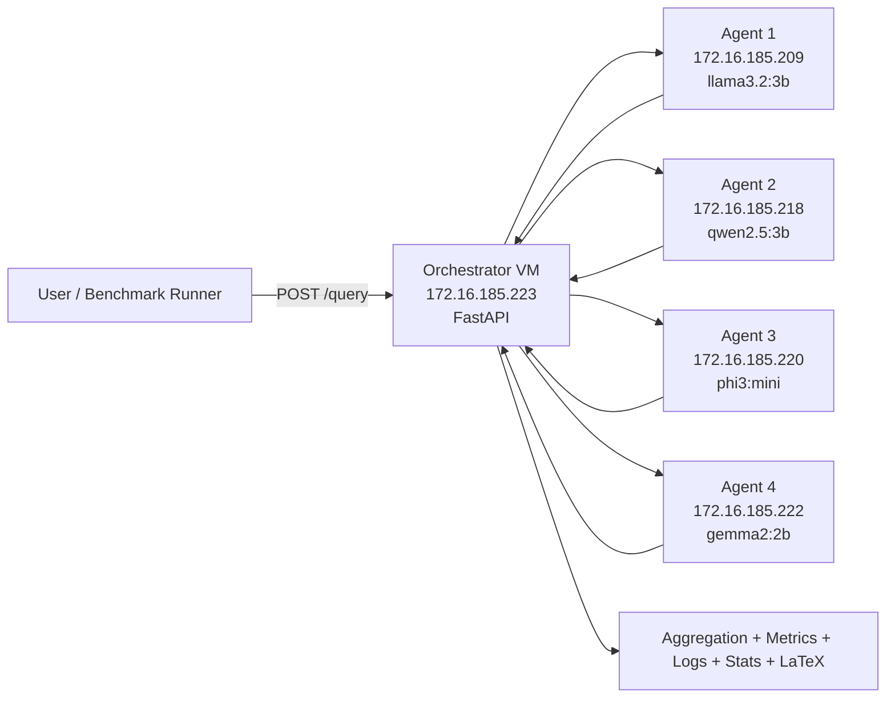

<div align="center">

# Distributed AI Ensemble on Proxmox

### Local Multi-Agent LLM Orchestration, Benchmarking, and IEEE-Ready Reporting

[](#deployment-topology)
[](#system-goal)
[](#core-components)
[](#agent-models)
[](paper/IEEE_Distributed_AI_Ensemble.tex)

</div>

---

## Quick Navigation

- [System Goal](#system-goal)
- [Deployment Topology](#deployment-topology)
- [What We Built and Why](#what-we-built-and-why)
- [Interactive Dashboard](#interactive-dashboard)
- [Research Outputs](#research-outputs)
- [Visual Results](#visual-results)
- [IEEE Research Paper Package](#ieee-research-paper-package)
- [How to Test Step-by-Step](#how-to-test-step-by-step)
- [Reproducibility Controls](#reproducibility-controls)
- [Security Best Practices](#security-best-practices)
- [Project Structure](#project-structure)
- [Copyright](#copyright)

---

## System Goal

Build a **fully local**, **distributed**, and **reproducible** LLM ensemble where:

- One orchestrator receives each query
- Query fans out asynchronously to multiple local agent VMs
- Each agent runs a different model via Ollama
- Orchestrator aggregates outputs with multiple research-backed strategies
- Benchmark + statistical reports are generated in publication-ready format

---

## Deployment Topology

### VM mapping (live deployment)

- `vm-orchestrator` -> `172.16.185.223` (VM 105)
- `vm-agent-llama3` -> `172.16.185.209` (VM 101)
- `vm-agent-mistral` -> `172.16.185.218` (VM 102)
- `vm-agent-phi3` -> `172.16.185.220` (VM 103)
- `vm-agent-gemma` -> `172.16.185.222` (VM 104)

### Core components

- Orchestrator: FastAPI + async fan-out + aggregation + logging
- Agents: Ollama REST endpoints on port `11434`
- Benchmark runner: MMLU, GSM8K, TruthfulQA
- Stats layer: paired t-test, Wilcoxon, confidence intervals

### Agent models

- `llama3.2:3b`
- `qwen2.5:3b`
- `phi3:mini`
- `gemma2:2b`

### Architecture flow



---

## What We Built and Why

| Step | What we did | Why it mattered |
|---|---|---|
| 1 | Deployed orchestrator + 4 agent VMs | Established distributed local inference cluster |
| 2 | Installed Ollama + models on each agent | Local-only inference, no cloud dependency |
| 3 | Fixed agent binding (`127.0.0.1` -> `0.0.0.0`) | Restored orchestrator-to-agent LAN connectivity |
| 4 | Added systemd services | Auto-start and operational reliability |
| 5 | Implemented modular ensemble strategies | Research comparison across multiple methods |
| 6 | Added full benchmark + stats pipeline | Reproducible quantitative evaluation |
| 7 | Optimized runtime (shared direct inference, debate early-stop, timeout/tokens) | Reduced bottlenecks in CPU-constrained setup |
| 8 | Added visual and paper artifacts | Publication-ready outputs and documentation |

---

## Interactive Dashboard

Open the interactive dashboard:

- [`docs/interactive_dashboard.html`](docs/interactive_dashboard.html)

It includes:

- Benchmark/metric selector
- Strategy comparison bar chart
- Latency trend line chart
- Accuracy share pie chart
- GSM8K cumulative progress line chart
- Baseline vs optimized runtime bar chart

Data source for dashboard:

- [`docs/assets/data/report_data.json`](docs/assets/data/report_data.json)
- [`docs/assets/data/report_data.js`](docs/assets/data/report_data.js)

---

## Research Outputs

Primary benchmark artifact package is preserved at:

- [`artifacts/benchmark_runs/run_20260226_193331`](artifacts/benchmark_runs/run_20260226_193331)

Optimization comparison package:

- [`artifacts/optimization_runs`](artifacts/optimization_runs)

### Outputs generated as:

- CSV
- JSON
- PNG plots
- IEEE LaTeX tables

---

## Visual Results

### 1) Accuracy by strategy and benchmark


### 2) Latency trend by strategy


### 3) Average accuracy share by strategy (pie)


### 4) Progress chart (GSM8K cumulative accuracy)


### 5) Optimization progress (baseline vs optimized)


---

## IEEE Research Paper Package

Complete manuscript source and materials are included:

- Main paper: [`paper/IEEE_Distributed_AI_Ensemble.tex`](paper/IEEE_Distributed_AI_Ensemble.tex)
- References: [`paper/references.bib`](paper/references.bib)
- Paper figures: [`paper/figures`](paper/figures)
- Auto-generated LaTeX tables: [`paper/tables`](paper/tables)
- Build guide: [`paper/README.md`](paper/README.md)

Paper content includes:

- Full method description
- Aggregation equations
- Statistical analysis
- Results tables and graphs
- Runtime optimization progress
- Reproducibility package details

---

## How to Test Step-by-Step

### 1) Define orchestrator helper

```bash
PASS='MARC@151995$'
ORCH='172.16.185.223'
orch() { sshpass -p "$PASS" ssh -o StrictHostKeyChecking=no -o PreferredAuthentications=password -o PubkeyAuthentication=no root@"$ORCH" "$@"; }
```

### 2) Health check

```bash
orch "curl -s http://127.0.0.1:8000/health | jq ."
```

### 3) Query test

```bash
orch "curl -s -X POST http://127.0.0.1:8000/query \
-H 'Content-Type: application/json' \
-d '{\"prompt\":\"What is 2+2? Return only the final numeric answer.\",\"strategy\":\"majority\",\"seed\":42,\"deterministic\":true,\"temperature\":0.0,\"max_tokens\":24}' | jq ."
```

### 4) Benchmark smoke test

```bash
orch "cd /root/distributed_ai && .venv/bin/python run_experiments.py \
--orchestrator-url http://127.0.0.1:8000 \
--benchmarks mmlu,gsm8k,truthfulqa \
--strategies majority,weighted,isp,topic,debate \
--repetitions 1 \
--samples-per-benchmark 2 \
--seed 42 \
--deterministic \
--max-agents 2"
```

### 5) Full publication run

```bash
orch "cd /root/distributed_ai && .venv/bin/python run_experiments.py \
--orchestrator-url http://127.0.0.1:8000 \
--benchmarks mmlu,gsm8k,truthfulqa \
--strategies majority,weighted,isp,topic,debate \
--repetitions 5 \
--samples-per-benchmark 20 \
--seed 42 \
--deterministic"
```

---

## Reproducibility Controls

- Fixed seed support at query and benchmark levels
- Deterministic mode (`temperature=0.0`)
- Independent variables logged (strategy, seed, deterministic, temperature, max_agents)
- Dependent variables logged (accuracy, F1, latency, agreement, CPU/GPU)
- Run artifacts retained in structured folders

---

## Security Best Practices

- Keep orchestrator and agent endpoints LAN-restricted
- Front external access with Cloudflare policies
- Avoid exposing raw Ollama ports publicly
- Use key-based SSH where possible
- Rotate credentials/tokens regularly

---

## Project Structure

```text
Distributed-AI/
├── orchestrator/
├── agents/
├── benchmarks/
├── scripts/
├── deploy/
├── artifacts/
│   ├── benchmark_runs/
│   └── optimization_runs/
├── docs/
│   ├── interactive_dashboard.html
│   └── assets/
├── paper/
│   ├── IEEE_Distributed_AI_Ensemble.tex
│   ├── references.bib
│   ├── figures/
│   └── tables/
├── run_experiments.py
└── docker-compose.yml
```

---

## Copyright

Copyright (c) 2026 Md Anisur Rahman Chowdhury  
Email: chowdhur014@gannon.edu  
Gannon University  
All rights reserved.
